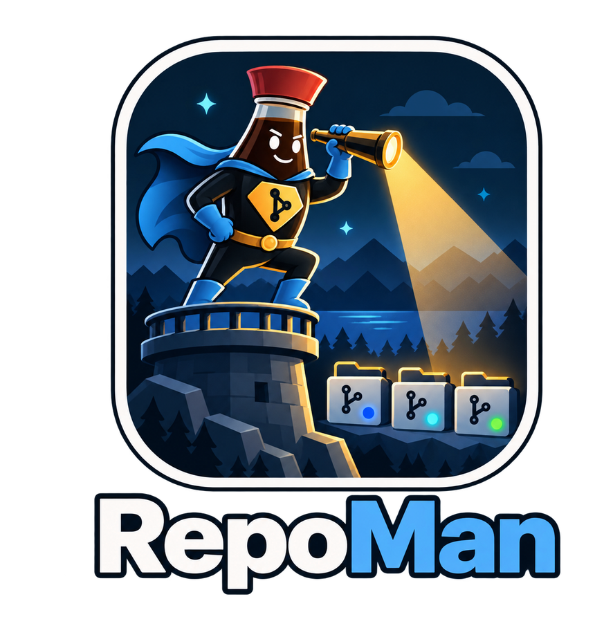
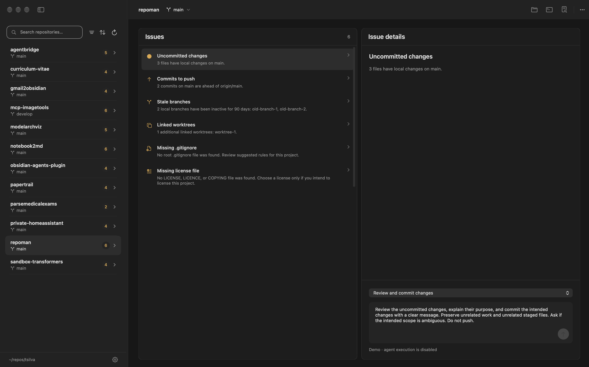
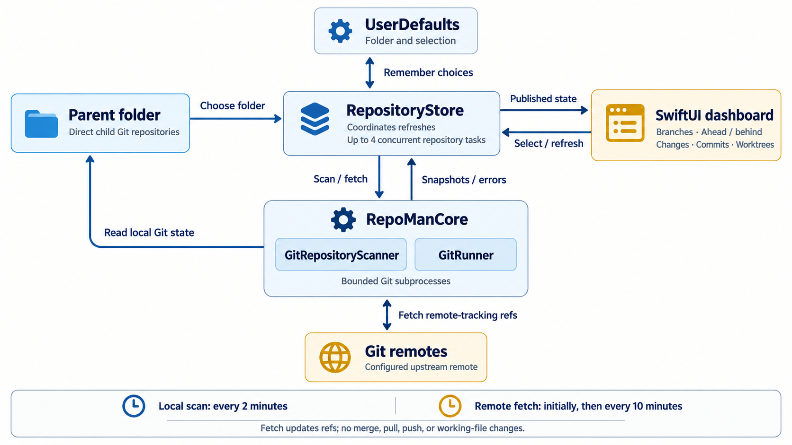

<p align="center">
  
  <br />
  <strong>🔭 Keep your Git repositories in sight 📂</strong>
</p>

<p align="center">
  <a href="https://github.com/tsilva/repoman/blob/main/RepoMan.xcodeproj/project.pbxproj"></a>
</p>

RepoMan is a macOS app for developers managing several Git repositories in one parent folder. See uncommitted changes, commits to push or pull, stale branches, and linked worktrees in one dashboard. Build it from source, choose your repositories folder, and select a repository to inspect recent commits and file changes.



## Install

Requires **macOS 27 or later**, **Xcode 27**, and Git from the Xcode command line tools.

```bash
git clone https://github.com/tsilva/repoman.git
cd repoman
open RepoMan.xcodeproj
```

In Xcode, select the **RepoMan** scheme and run it on your Mac. In the app, click **Choose Folder…** and select the parent folder containing your repositories.

Search by repository name, filter by status, or sort by counts to find repositories needing attention. Select one to see its recent commits and per-file added and removed lines. RepoMan remembers your folder and selected repository between launches.

## Commands

Run these from the repository root:

```bash
swift test  # run core tests, including Git scanner integration tests

# Build the app locally
xcodebuild -project RepoMan.xcodeproj -scheme RepoMan \
  -configuration Debug -derivedDataPath DerivedData build

# Show illustrative data for design review
open DerivedData/Build/Products/Debug/RepoMan.app --args --demo

# Test, build, sign, and verify an Apple Silicon DMG and checksum in dist/
bash .codex/skills/build-release/scripts/build-release.sh
```

## Notes

- Discovery checks visible direct child folders containing a `.git` directory or file, including linked worktrees. It does not scan nested folders.
- Local status refreshes every two minutes. Repositories with an upstream fetch after the initial scan and every ten minutes. **Refresh** checks the selected repository; **Refresh All** checks every repository.
- Fetch updates remote-tracking refs without merging, pulling, pushing, or changing working files. Git commands have timeouts and disable interactive credential prompts; failed fetches keep local status visible.
- Push/pull counts show a dash without a configured upstream. Stale branches have a last commit older than 90 days, excluding `main`, `master`, the current branch, and branches checked out in any worktree. Worktree counts exclude the primary worktree.
- The screenshot and `--demo` mode use illustrative data.
- Local packaging writes an Apple Silicon DMG and SHA-256 checksum under `dist/`. Pushing a `vX.Y.Z` tag triggers the [release workflow](.github/workflows/release.yml) to publish them. Builds are signed ad hoc without Developer ID signing or Apple notarization; Gatekeeper may require manual approval.

## Architecture



## License

No license is declared in this repository.
