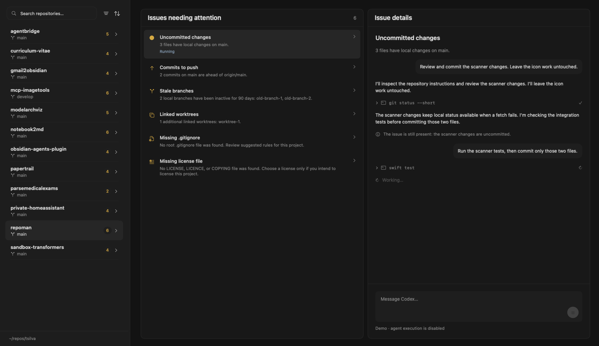

<p align="center">
  
  <br />
  <!-- repo-tagline:start -->
  <strong>🔎 Find issues across your Git repositories. Fix them with AI 🤖</strong>
  <!-- repo-tagline:end -->
</p>

<p align="center">
  <a href="https://github.com/tsilva/repoman/blob/main/RepoMan.xcodeproj/project.pbxproj"></a>
</p>

RepoMan is a macOS app for developers managing several local Git repositories. See uncommitted changes, commits to push or pull, stale branches, linked worktrees, missing project files, failing CI, and missing CI coverage in one dashboard. Build it from source, choose your repositories' parent folder, and repair issues through a Codex conversation for each issue.


## Install

Download the Apple Silicon DMG from [GitHub Releases](https://github.com/tsilva/repoman/releases/latest), open it, and drag **RepoMan** to **Applications**. Requires **macOS 27 or later** and Git from the Xcode command line tools. The app is signed ad hoc and is not notarized; macOS may require approval on first launch.

RepoMan checks for a newer stable GitHub release at startup and every six hours. When a compatible DMG and checksum are available, a blue download button appears at the bottom of the sidebar (or in the toolbar when the sidebar is hidden). Click it to download, verify, install, and restart automatically. **RepoMan → Check for Updates…**, **About RepoMan**, and **Settings → General** also provide update controls. Checks use the public GitHub API and need no GitHub login.

The updater verifies the release’s SHA-256 checksum, GitHub asset digest when provided, app identity, version, macOS requirement, and code signature before quitting. Updates are disabled while repairs, repository checks, or Git syncs are running. It saves conversations and replaces the app in its current location. A backup is kept until the replacement launches; installation or launch failures restore the previous version. Install in a writable Applications folder (such as `~/Applications`); apps running from the DMG or macOS App Translocation must be moved first. Development builds and demo mode cannot install updates. Ad-hoc signatures provide integrity checks; update authenticity relies on HTTPS and the repository’s GitHub release assets.

To build from source, install **Xcode 27**:

```bash
git clone https://github.com/tsilva/repoman.git
cd repoman
open RepoMan.xcodeproj
```

In Xcode, select the **RepoMan** scheme and run it on your Mac.

## Use

Click **Choose Folder…** and select the parent folder containing your repositories. Search, filter, or sort to find repositories needing attention; filter and sort controls sit beside the search field. Select a repository to see its **Issues** tree. Repeated issue types expand into individual file or subject instances. Select an instance to inspect its evidence, or use the aligned checkboxes to select several instances of the same type in one repository. Group arrows expand or collapse their children, with faint separators between issues. The group review offers **Select available instances to repair** for a shared repair. Click a group title to review its instances and conversations, then use **Confirm & archive all completed** to archive finished sessions together. The folder and terminal buttons in the toolbar open the selected repository in Finder or Terminal.

Git activity appears beneath each repository's issue badges as **↓** commits to pull, **↑** commits to push, and **●** changed files. Zero counts stay hidden. Click the **↑↓ Sync** icon at the top right of **Issues** to pull and push directly when there are no local file changes. A spinner shows progress, the tooltip reports success, and failures show an alert. When files have changed, Sync opens a popup to review files, view the diff, and enter a description. **Commit & Sync** commits selected files, merges incoming commits, and pushes to the current branch's configured upstream. Unselected staged changes are preserved; incoming commits require all local changes to be committed. Sync reports progress and errors directly, and never force-pushes, rebases, or automatically stashes files. A failed push leaves local commits saved. Finish merge conflicts or configure a missing upstream in your editor or Terminal, then reopen Sync. After success, the popup shows the current branch status, committed-file count, and message subject. Click **Done** to close it, or **Review remaining changes** to start a fresh review of files left locally. Clicking outside dismisses the popup.

The commit message box grows as you type and supports a subject and body separated by a blank line. Opening Sync automatically drafts a message from selected changes. The editor stays disabled with a spinner and **Generating commit message...** until the draft is ready. Edit it before committing, or click the wand to generate another draft. Generation uses RepoMan’s Codex login with `gpt-6.1-sol` and low reasoning effort. Large messages scroll within the popup.

For other issues, choose a repair preset or write custom instructions, edit the prompt, then click the **send button** at the bottom right of the textarea, or press **⌘Return**. Missing files and worktree or branch cleanup use the agent workflow. Selecting a preset does not run it.

Each repair session has one conversation and a fixed scope of one or more issue instances. Selected instances share a Codex thread, while each is verified independently. Completed and actively repaired instances are excluded from new selections. Conversation history preserves earlier individual and shared sessions; follow-ups continue the selected session. The send button inside the composer (or ⌘Return) sends the draft to Codex; submitted messages become read-only chat bubbles. The composer stays below the stream, and presets help compose the first prompt and disappear once it is sent. Assistant messages use Markdown, and shell commands expand to show their output. Animated thinking and working indicators show progress while waiting for Codex. Answer questions in the stream or stop the current turn from the composer.

After every turn, RepoMan checks the issue again. If it remains or verification is unavailable, send another message in the same Codex thread. Conversations survive switching issues and restarting the app. Different issues can run at the same time, including in the same repository; each chat has its own Codex connection. Confirmed resolution keeps the issue in the list with a Finished state. Its conversation remains selectable and readable, with its composer removed. Finished issues keep their complete conversations across restarts and do not count toward outstanding issues. Repairs run without approval prompts inside the selected repository; sandboxed commands cannot read or write other personal files or repositories.



Install and sign in to the **Codex CLI** before running repairs. RepoMan automatically finds Codex and starts `codex app-server` over stdio. Every turn uses **GPT-6.1 Sol** (`gpt-6.1-sol`) with **high** reasoning effort, repository-scoped permissions, and approvals disabled. Authentication remains managed by Codex; RepoMan does not copy its credentials.

After each turn ends, RepoMan collects fresh repository state and reruns the original detector. The issue disappears only when inspection confirms it is absent. An agent finishing successfully can still leave the issue present; failed inspection produces **Couldn’t verify**. Creating a README can resolve that issue while introducing an uncommitted-change finding.

Open **Settings…** from the toolbar's overflow menu or press **⌘,** to enable or disable issue checks globally. Settings groups checks by Git, repository files, CI, and inspection, and saves changes automatically. Search settings to find a check, or use **General** to change the monitored folder. These display preferences do not cancel tasks or count as successful repairs.

**CI failing** reads GitHub check runs and commit statuses for the latest published default-branch commit and the tracked branch (or matching published local branch). Install the GitHub CLI and sign in with `gh auth login`; RepoMan finds `gh` automatically and uses its existing login. Failed checks include a link to CI details. Pending, cancelled, missing, inaccessible, or incomplete results stay unavailable and cannot confirm a repair. Local unpushed changes are not represented by remote CI results.

**Missing CI coverage** inspects local GitHub Actions workflows in code projects for recognizable build, test, lint, or type-check commands on branch pushes or pull requests. Dependency review, manual workflows, and tag-only releases do not satisfy it. This is a conservative configuration check, not a measurement of test coverage: custom actions, unrecognized scripts, reusable workflows, unsupported YAML, and external CI configurations may require review and are reported as unavailable.

Additional checks cover dependency safeguards, lockfile and runtime consistency, Actions security, unpublished branches and upstream tracking, potential tracked secrets, oversized files, submodule/LFS checkout integrity, leftover merge markers, broken project and documentation references, tracked generated files, old stashes, unfinished Git operations, published description drift, and opt-in notebook hygiene. GitHub repositories whose names start with `private-` (case-insensitive) must have private visibility; public and internal visibility are flagged. Refresh only reads visibility; the repair action can make the repository private. See [additional checks and per-repository exceptions](docs/additional-checks.md) for `.repoman.json` configuration.

Repositories declaring `tsilva.eu` domains in `.repo-metadata.toml` also receive separate availability, Sentry, Google Analytics, and Cloudflare proxy checks. See [website checks](docs/website-checks.md) for configuration, delivery verification, and the Vercel domain inventory tool.

See [the detector, recipe, and task architecture](docs/issues.md) for extending the workflow.

## Commands

In Codex, `$build-release` or `/build-release` builds, verifies, and publishes a
GitHub Release. Request a local build explicitly to keep the artifacts local.
The shell helper below builds local artifacts without publishing.

```bash
swift test  # run core and Git integration tests

# Build the app locally
xcodebuild -project RepoMan.xcodeproj -scheme RepoMan \
  -configuration Debug -derivedDataPath DerivedData build

# Show illustrative data for design review
open DerivedData/Build/Products/Debug/RepoMan.app --args --demo

# Verify update replacement and relaunch using disposable demo app copies
swiftc -parse-as-library RepoManCore/AppUpdate.swift \
  RepoManCore/AppUpdateInstaller.swift Tools/VerifyAppUpdate.swift \
  -o .build/verify-app-update
.build/verify-app-update DerivedData/Build/Products/Debug/RepoMan.app

# Test and package an Apple Silicon DMG with a SHA-256 checksum
bash .codex/skills/build-release/scripts/build-release.sh
```

## Notes

- Discovery scans visible direct child repositories with a `.git` directory or file. Linked worktrees are excluded from the repository list and shown under their primary repository. Nested folders are not scanned.
- RepoMan remembers your folder, selected repository, filter, sort mode and direction, ignored checks, and disabled checks. Issues and their conversations persist under `~/Library/Application Support/RepoMan/repair-tasks.json`; interrupted sessions are reconciled without automatically replaying their prompts.
- While a repository is being checked, a spinner replaces its issue counter. Each repository returns to its issue count as soon as its check finishes.
- RepoMan automatically checks all repositories once at startup, fetching configured remotes even without an upstream and pruning deleted remote-tracking branches. Checks do not repeat on a timer. Choosing a folder checks its repositories; **Refresh** checks the selected repository and **Refresh All** explicitly checks all repositories. Repairs verify the affected repository when work stops.
- Refresh fetches remote-tracking refs without merging, pulling, pushing, or changing working files. Git commands have timeouts and disable credential prompts. Failed fetches keep local status visible, but remote counts may be outdated.
- Repository changes come from explicit Sync actions or queued agent repairs. Sync runs off the main actor and pauses refresh and repair scheduling while it changes Git state. RepoMan rechecks the reviewed branch, upstream, index, and files before committing.
- Git counts require a known upstream comparison for push/pull. Routine changes, push/pull, and divergence appear through Sync instead of agent issues. Stale branches have no commits in 90 days, excluding `main`, `master`, and branches checked out in any worktree. Linked worktrees exclude the primary worktree and appear as informational findings.
- Refresh skips repositories sharing the active repair’s Git common directory, including linked worktrees, while continuing to inspect other repositories. Locks and checks coordinate RepoMan work; external Git tools can still change a checkout.
- The screenshots and `--demo` mode use illustrative data. Demo mode cannot run agents, answer agent questions, cancel real tasks, or persist repair runs.
- Local packaging writes a DMG and checksum under `dist/`. Pushing a `vX.Y.Z` tag publishes them through the [release workflow](.github/workflows/release.yml). Packaging preserves the signed app's metadata and verifies its signature before creating the DMG and again after mounting it. Packaged builds are signed ad hoc and are not notarized; Gatekeeper may require manual approval.
- No license is declared in this repository.

## Architecture

The diagram shows discovery and refresh. The [checks and repairs guide](docs/issues.md) explains issue detection, prompt recipes, queued agent work, and verification.


## AgentBridge routing

Model requests use only AgentBridge. Set `AGENTBRIDGE_BASE_URL` to its API root
(default `http://127.0.0.1:8082/api/v1`). `AGENTBRIDGE_API_KEY` is an optional
gateway token. OpenRouter credentials belong to AgentBridge. Existing model
choices are retained; raw upstream IDs gain `openrouter/` only on outbound
requests. There is no direct OpenRouter endpoint or fallback. Hosted deployments
must configure a reachable AgentBridge URL instead of the loopback default.
